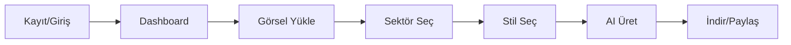

<div align="center">

# ✨ ProductGenius Studio

### *AI-Powered Professional Product Photography*

[](https://reactjs.org/)
[](https://www.typescriptlang.org/)
[](https://vitejs.dev/)
[](https://ai.google.dev/)
[](https://www.docker.com/)

<br/>


<br/>

**Profesyonel işletmelere profesyonel ürün çekimi**

*Ürün fotoğraflarınızı saniyeler içinde stüdyo kalitesinde görsellere dönüştürün*

[🚀 Demo](#demo) • [📦 Kurulum](#kurulum) • [🐳 Docker](#docker-deployment) • [📖 Dokümantasyon](#kullanım)

</div>

---

## 🎯 Özellikler

| Özellik | Açıklama |
|---------|----------|
| 🎨 **AI Görsel Üretimi** | Google Gemini AI ile profesyonel ürün görselleri |
| 🏢 **9 Farklı Sektör** | Elektronik, Ayakkabı, Moda, İç Giyim, Çanta, Takı, Aksesuar, Ev Dekor, Kozmetik |
| 🌆 **5 Sahne Stili** | Stüdyo, Yaşam Tarzı, Lüks, Doğa, Şehir |
| 📐 **Çoklu Çözünürlük** | 1K, 2K, 4K kalite seçenekleri |
| 👥 **Kullanıcı Yönetimi** | Kredi sistemi, paket yönetimi, admin paneli |
| 🌙 **Dark/Light Mode** | Göz yormayan modern arayüz |

---

## 🛠️ Teknoloji Stack

```
Frontend          Backend/AI         DevOps
─────────         ──────────         ──────
React 19.2        Gemini AI          Docker
TypeScript 5.8    Google GenAI       PostgreSQL
Vite 6.2          REST API           AWS EC2
TailwindCSS       LocalStorage*      Nginx
Lucide Icons                         
```
> *PostgreSQL entegrasyonu için aşağıdaki Docker bölümüne bakın

---

## 🚀 Kurulum

### Gereksinimler

- Node.js 18+
- npm veya yarn
- [Gemini API Key](https://aistudio.google.com/apikey)

### Yerel Geliştirme

```bash
# 1. Repoyu klonlayın
git clone https://github.com/huseyinhobek/Product-Genius-Studio.git
cd Product-Genius-Studio

# 2. Bağımlılıkları yükleyin
npm install

# 3. Ortam değişkenlerini ayarlayın
cp .env.example .env
# .env dosyasını düzenleyin ve GEMINI_API_KEY'i ekleyin

# 4. Geliştirme sunucusunu başlatın
npm run dev
```

Uygulama `http://localhost:3000` adresinde çalışacaktır.

### Ortam Değişkenleri

```env
GEMINI_API_KEY=your_gemini_api_key_here
```

---

## 🐳 Docker Deployment

### AWS Ubuntu + Docker + PostgreSQL Kurulumu

Production ortamında uygulamayı Docker container içinde PostgreSQL veritabanı ile çalıştırmak için:

#### 1. AWS EC2 Hazırlığı

```bash
# Ubuntu sunucusuna bağlanın
ssh -i your-key.pem ubuntu@your-ec2-ip

# Sistem güncellemesi
sudo apt update && sudo apt upgrade -y
```

#### 2. Docker Kurulumu

```bash
# Docker kurulumu
curl -fsSL https://get.docker.com -o get-docker.sh
sudo sh get-docker.sh

# Docker Compose kurulumu
sudo apt install docker-compose -y

# Kullanıcıyı docker grubuna ekle
sudo usermod -aG docker $USER
newgrp docker
```

#### 3. Proje Dosyalarını Oluşturun

**`Dockerfile`**
```dockerfile
FROM node:18-alpine AS builder
WORKDIR /app
COPY package*.json ./
RUN npm ci
COPY . .
RUN npm run build

FROM nginx:alpine
COPY --from=builder /app/dist /usr/share/nginx/html
COPY nginx.conf /etc/nginx/conf.d/default.conf
EXPOSE 80
CMD ["nginx", "-g", "daemon off;"]
```

**`docker-compose.yml`**
```yaml
version: '3.8'

services:
  app:
    build: .
    ports:
      - "80:80"
    environment:
      - GEMINI_API_KEY=${GEMINI_API_KEY}
    depends_on:
      - db
    restart: always

  db:
    image: postgres:15-alpine
    environment:
      POSTGRES_DB: productgenius
      POSTGRES_USER: pguser
      POSTGRES_PASSWORD: ${DB_PASSWORD}
    volumes:
      - postgres_data:/var/lib/postgresql/data
    ports:
      - "5432:5432"
    restart: always

volumes:
  postgres_data:
```

**`nginx.conf`**
```nginx
server {
    listen 80;
    server_name _;
    root /usr/share/nginx/html;
    index index.html;

    location / {
        try_files $uri $uri/ /index.html;
    }

    location /api {
        proxy_pass http://localhost:3001;
        proxy_http_version 1.1;
        proxy_set_header Upgrade $http_upgrade;
        proxy_set_header Connection 'upgrade';
        proxy_set_header Host $host;
        proxy_cache_bypass $http_upgrade;
    }
}
```

#### 4. Deploy

```bash
# Ortam değişkenlerini ayarlayın
echo "GEMINI_API_KEY=your_key_here" >> .env
echo "DB_PASSWORD=your_secure_password" >> .env

# Container'ları başlatın
docker-compose up -d --build

# Logları kontrol edin
docker-compose logs -f
```

#### 5. Güvenlik Duvarı (UFW)

```bash
sudo ufw allow 80/tcp
sudo ufw allow 443/tcp
sudo ufw enable
```

---

## 📖 Kullanım

### Kullanıcı Akışı



### Admin Paneli

- Kullanıcı yönetimi
- Kredi onaylama
- Paket aktivasyonu
- Sistem istatistikleri

---

## 📁 Proje Yapısı

```
Product-Genius-Studio/
├── components/
│   ├── AdminPanel.tsx      # Admin yönetim paneli
│   ├── Auth.tsx            # Kimlik doğrulama
│   ├── Dashboard.tsx       # Ana kontrol paneli
│   ├── LandingPage.tsx     # Açılış sayfası
│   ├── Loading.tsx         # Yükleme animasyonu
│   ├── ProductDisplay.tsx  # Ürün görüntüleme
│   └── ...
├── services/
│   └── geminiService.ts    # Gemini AI entegrasyonu
├── App.tsx                 # Ana uygulama
├── types.ts                # TypeScript tipleri
├── vite.config.ts          # Vite yapılandırması
└── package.json
```

---

## 🔐 Güvenlik Notları

> ⚠️ **Production için önemli:**
> - `.env` dosyasını asla commit etmeyin
> - API anahtarlarını güvenli tutun
> - PostgreSQL şifrelerini güçlü seçin
> - HTTPS kullanın (Let's Encrypt önerilir)
> - Rate limiting uygulayın

---

## 🤝 Katkıda Bulunma

1. Fork edin
2. Feature branch oluşturun (`git checkout -b feature/amazing-feature`)
3. Commit edin (`git commit -m 'feat: Add amazing feature'`)
4. Push edin (`git push origin feature/amazing-feature`)
5. Pull Request açın

---

## 📄 Lisans

Bu proje [Apache 2.0](LICENSE) lisansı altında lisanslanmıştır.

---

<div align="center">

### 🌟 Star vererek projeyi destekleyin!

**Made with ❤️ by [huseyinhobek](https://github.com/huseyinhobek)**

[⬆ Başa Dön](#-productgenius-studio)

</div>
